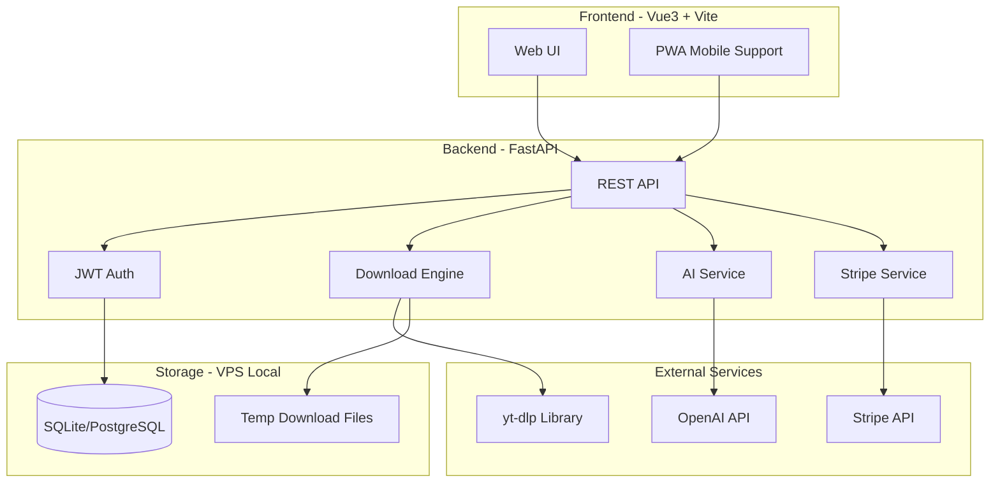

# 万能视频下载网站 - 技术方案

## 一、整体架构



## 二、UI 设计方案

模仿 cobalt.tools 的极简风格，但加入**渐变色彩**和**付费引导元素**：

- **配色**：深色主题为主（#0a0a0f 背景），搭配紫色-蓝色渐变高亮（#7c3aed -> #3b82f6），营造高级感
- **布局**：居中大输入框 + 粘贴按钮，上方品牌 logo，下方功能选项
- **付费引导**：免费用户每日 3 次下载，超出后显示优雅的升级弹窗；清晰度选项中，1080p+ 标记为 PRO
- **移动端**：响应式设计，底部 Tab 导航
- **特色**：下载进度动画、支持平台图标展示、历史记录面板

## 三、核心功能模块

### 3.1 视频下载引擎（核心）

直接封装 yt-dlp Python 库，不修改源码：

```python
from yt_dlp import YoutubeDL

async def extract_video_info(url: str) -> dict:
    ydl_opts = {'quiet': True, 'no_warnings': True}
    with YoutubeDL(ydl_opts) as ydl:
        info = ydl.extract_info(url, download=False)
        return ydl.sanitize_info(info)
```

**下载模式（三种策略）：**

- 直链可用且未过期 --> 302 重定向给用户直接下载
- 直链不可用/有防盗链 --> 服务端代理下载，返回给用户
- 大文件 > 500MB --> StreamingResponse 流式传输

### 3.2 用户系统

- JWT Token 认证
- 免费用户：每日 3 次下载，最高 720p
- PRO 用户：无限下载，最高 4K，优先队列

### 3.3 付费系统（Stripe）

- 月度订阅：$9.9/月
- 年度订阅：$99/年（省 17%）
- Stripe Checkout Session + Webhook 处理

### 3.4 增值功能

- **视频总结**：调用 OpenAI API 对字幕/转录文本进行 AI 总结
- **字幕翻译**：提取字幕后调用翻译 API，支持多语言
- **批量下载**：PRO 用户支持播放列表批量解析

## 四、技术栈明细

| 层          | 技术                                      |
| ----------- | ----------------------------------------- |
| 前端框架    | Vue 3 + Composition API                   |
| 构建工具    | Vite 6                                    |
| UI 库       | 不使用重型 UI 库，手写 CSS + Tailwind CSS |
| HTTP 客户端 | Axios                                     |
| 状态管理    | Pinia                                     |
| 后端框架    | FastAPI                                   |
| 下载引擎    | yt-dlp (pip library)                      |
| 数据库      | SQLite（初期）/ PostgreSQL（扩展）        |
| ORM         | SQLAlchemy                                |
| 认证        | JWT (python-jose)                         |
| 支付        | Stripe Python SDK                         |
| AI          | OpenAI Python SDK                         |
| 任务队列    | asyncio + 内存队列（初期）                |
| 部署        | Docker Compose on VPS                     |

## 五、项目目录结构

```
video-downloader/
├── frontend/                # Vue 3 前端
│   ├── src/
│   │   ├── views/          # 页面
│   │   ├── components/     # 组件
│   │   ├── stores/         # Pinia 状态
│   │   ├── api/            # API 调用
│   │   ├── assets/         # 静态资源
│   │   └── router/         # 路由
│   ├── index.html
│   ├── vite.config.ts
│   └── package.json
├── backend/                 # FastAPI 后端
│   ├── app/
│   │   ├── main.py         # 入口
│   │   ├── api/            # 路由
│   │   ├── core/           # 配置、安全
│   │   ├── models/         # 数据模型
│   │   ├── services/       # 业务逻辑
│   │   │   ├── download.py # 下载引擎
│   │   │   ├── payment.py  # 支付服务
│   │   │   └── ai.py       # AI 服务
│   │   └── schemas/        # Pydantic 模型
│   ├── requirements.txt
│   └── Dockerfile
├── docker-compose.yml
└── README.md
```

## 六、API 设计

- `POST /api/parse` - 解析视频链接，返回可用格式列表
- `GET /api/download/{task_id}` - 下载视频（重定向/代理/流式）
- `POST /api/auth/register` - 注册
- `POST /api/auth/login` - 登录
- `GET /api/user/profile` - 用户信息
- `POST /api/payment/create-checkout` - 创建 Stripe 支付会话
- `POST /api/payment/webhook` - Stripe Webhook
- `POST /api/ai/summarize` - 视频总结
- `POST /api/ai/translate-subtitle` - 字幕翻译

## 七、开发分步计划

分 6 个阶段，每个阶段完成后找你验收：

1. **Phase 1**：项目骨架 + 前端 UI 首页（输入框、品牌、响应式布局）
2. **Phase 2**：后端下载引擎（yt-dlp 封装 + 三种下载模式）
3. **Phase 3**：前后端联调（解析 -> 选择格式 -> 下载完整流程）
4. **Phase 4**：用户系统 + 付费（注册登录 + Stripe 集成 + 用量限制）
5. **Phase 5**：增值功能（视频总结 + 字幕翻译）
6. **Phase 6**：Docker 部署 + 最终测试

## 八、关键设计决策

- **yt-dlp 集成方式**：纯 Python 库调用，不 fork 不修改源码，通过 `YoutubeDL` 类的 options 控制行为，最大限度减少维护成本
- **下载策略智能判断**：先 extract_info 获取直链，检测是否可直接访问（HEAD 请求验证），再决定采用哪种下载模式
- **临时文件管理**：代理下载的文件存放在 `/tmp/downloads/`，设置 30 分钟自动清理
- **并发控制**：使用 asyncio Semaphore 限制同时下载数，防止服务器过载