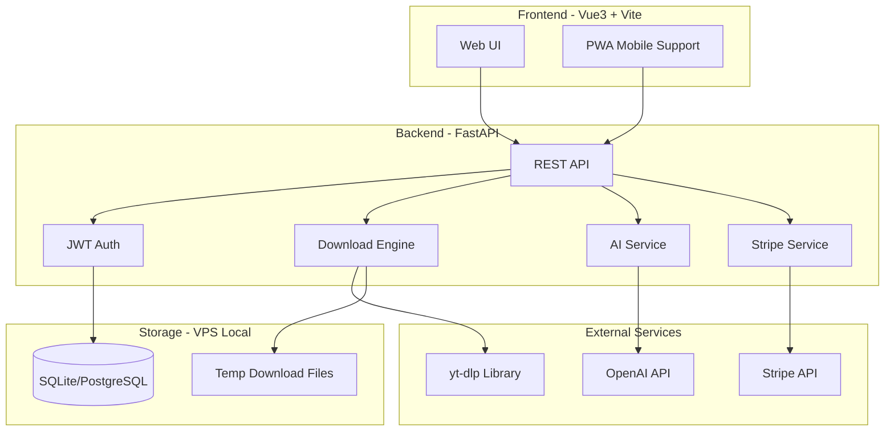
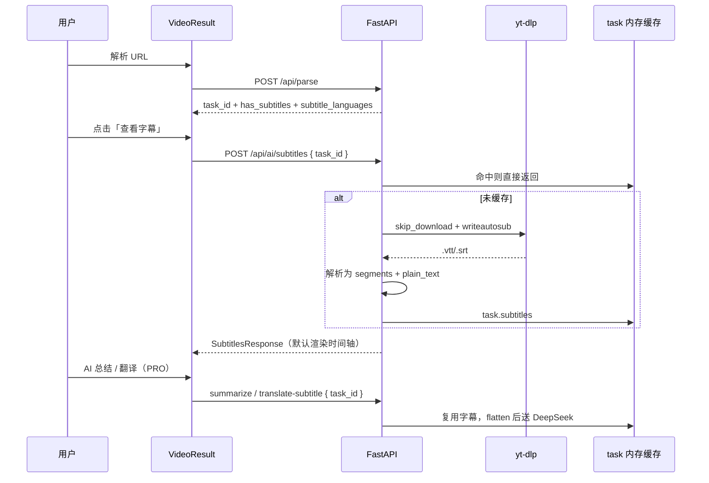
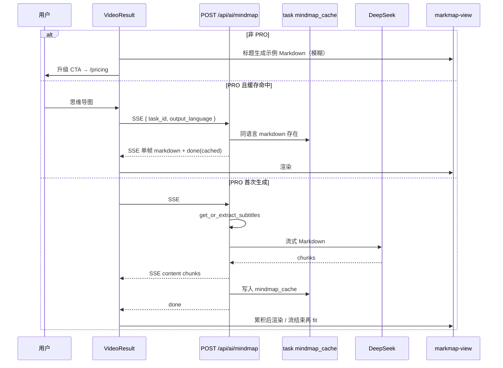
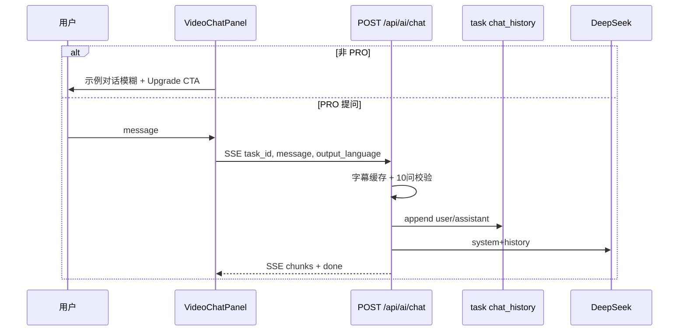

# 万能视频下载网站 - 技术方案

## 一、整体架构



## 二、UI 设计方案

模仿 cobalt.tools 的极简风格，但加入**渐变色彩**和**付费引导元素**：

- **配色**：深色主题为主（#0a0a0f 背景），搭配紫色-蓝色渐变高亮（#7c3aed -> #3b82f6），营造高级感
- **布局**：居中大输入框 + 粘贴按钮，上方品牌 logo，下方功能选项
- **付费引导**：免费用户每日 3 次下载，超出后显示优雅的升级弹窗；清晰度选项中，1080p+ 标记为 PRO
- **移动端**：响应式设计，底部 Tab 导航
- **特色**：下载进度动画、支持平台图标展示、历史记录面板

## 三、核心功能模块

### 3.1 视频下载引擎（核心）

直接封装 yt-dlp Python 库，不修改源码：

```python
from yt_dlp import YoutubeDL

async def extract_video_info(url: str) -> dict:
    ydl_opts = {'quiet': True, 'no_warnings': True}
    with YoutubeDL(ydl_opts) as ydl:
        info = ydl.extract_info(url, download=False)
        return ydl.sanitize_info(info)
```

**下载模式（三种策略）：**

- 直链可用且未过期 --> 302 重定向给用户直接下载
- 直链不可用/有防盗链 --> 服务端代理下载，返回给用户
- 大文件 > 500MB --> StreamingResponse 流式传输

### 3.2 用户系统

- JWT Token 认证
- 免费用户：每日 3 次下载，最高 720p
- PRO 用户：无限下载，最高 4K，优先队列

### 3.3 付费系统（Stripe）

- 月度订阅：$9.9/月
- 年度订阅：$99/年（省 17%）
- Stripe Checkout Session + Webhook 处理

### 3.4 增值功能

- **字幕/转录展示**：登录用户可查看、复制带时间轴的字幕全文（引流能力，见第十章）
- **视频总结**：调用 DeepSeek API 对字幕/转录文本进行 AI 总结（PRO）
- **视频问答**：基于字幕/转录的多轮 AI 对话（PRO，见第十二章）
- **字幕翻译**：基于真实字幕调用翻译 API（PRO，见第十章）
- **批量下载**：PRO 用户支持播放列表批量解析

## 四、技术栈明细

| 层          | 技术                                      |
| ----------- | ----------------------------------------- |
| 前端框架    | Vue 3 + Composition API                   |
| 构建工具    | Vite 6                                    |
| UI 库       | 不使用重型 UI 库，手写 CSS + Tailwind CSS |
| HTTP 客户端 | Axios                                     |
| 状态管理    | Pinia                                     |
| 后端框架    | FastAPI                                   |
| 下载引擎    | yt-dlp (pip library)                      |
| 数据库      | SQLite（初期）/ PostgreSQL（扩展）        |
| ORM         | SQLAlchemy                                |
| 认证        | JWT (python-jose)                         |
| 支付        | Stripe Python SDK                         |
| AI          | OpenAI Python SDK                         |
| 任务队列    | asyncio + 内存队列（初期）                |
| 部署        | Docker Compose on VPS                     |

## 五、项目目录结构

```
video-downloader/
├── frontend/                # Vue 3 前端
│   ├── src/
│   │   ├── views/          # 页面
│   │   ├── components/     # 组件
│   │   ├── stores/         # Pinia 状态
│   │   ├── api/            # API 调用
│   │   ├── assets/         # 静态资源
│   │   └── router/         # 路由
│   ├── index.html
│   ├── vite.config.ts
│   └── package.json
├── backend/                 # FastAPI 后端
│   ├── app/
│   │   ├── main.py         # 入口
│   │   ├── api/            # 路由
│   │   ├── core/           # 配置、安全
│   │   ├── models/         # 数据模型
│   │   ├── services/       # 业务逻辑
│   │   │   ├── download.py # 下载引擎
│   │   │   ├── payment.py  # 支付服务
│   │   │   └── ai.py       # AI 服务
│   │   └── schemas/        # Pydantic 模型
│   ├── requirements.txt
│   └── Dockerfile
├── docker-compose.yml
└── README.md
```

## 六、API 设计

- `POST /api/parse` - 解析视频链接，返回格式列表及 `has_subtitles`、`subtitle_languages`
- `GET /api/download/{task_id}` - 下载视频（重定向/代理/流式）
- `POST /api/auth/register` - 注册
- `POST /api/auth/login` - 登录
- `GET /api/user/profile` - 用户信息
- `POST /api/payment/create-checkout` - 创建 Stripe 支付会话
- `POST /api/payment/webhook` - Stripe Webhook
- `POST /api/ai/subtitles` - 获取字幕/转录文本（登录用户，带时间轴）
- `POST /api/ai/summarize` - 视频总结（PRO，`task_id`）
- `POST /api/ai/translate-subtitle` - 字幕翻译（PRO，`task_id` + `target_language`）
- `POST /api/ai/chat` - 视频内容 AI 问答（PRO，SSE，`task_id` + `message`，每 task 最多 10 问）

## 七、开发分步计划

分 6 个阶段，每个阶段完成后找你验收：

1. **Phase 1**：项目骨架 + 前端 UI 首页（输入框、品牌、响应式布局）
2. **Phase 2**：后端下载引擎（yt-dlp 封装 + 三种下载模式）
3. **Phase 3**：前后端联调（解析 -> 选择格式 -> 下载完整流程）
4. **Phase 4**：用户系统 + 付费（注册登录 + Stripe 集成 + 用量限制）
5. **Phase 5**：增值功能（视频总结 + 字幕翻译）
6. **Phase 6**：Docker 部署 + 最终测试

## 八、关键设计决策

- **yt-dlp 集成方式**：纯 Python 库调用，不 fork 不修改源码，通过 `YoutubeDL` 类的 options 控制行为，最大限度减少维护成本
- **下载策略智能判断**：先 extract_info 获取直链，检测是否可直接访问（HEAD 请求验证），再决定采用哪种下载模式
- **临时文件管理**：代理下载的文件存放在 `/tmp/downloads/`，设置 30 分钟自动清理
- **并发控制**：使用 asyncio Semaphore 限制同时下载数，防止服务器过载

## 九、视频总结功能 - DeepSeek 接入

### 9.1 方案概述

用 DeepSeek API 替换原有 OpenAI (`gpt-4o-mini`)，并实现"解析视频 → 提取字幕 → AI 总结"完整链路。

前端只需传 `task_id`，后端自动完成字幕提取与总结生成。

### 9.2 技术选型

- **模型**：`deepseek-chat`（DeepSeek V3），适合总结/翻译任务，速度快、成本低
- **SDK**：复用 `openai.AsyncOpenAI`，DeepSeek API 完全兼容 OpenAI 协议
- **参数差异**：仅改 `base_url`（`https://api.deepseek.com`）、`api_key`、`model`，无需额外依赖

### 9.3 字幕提取策略

通过 yt-dlp 的 `writesubtitles` / `writeautosub` 参数提取字幕：

- 优先使用**自动生成字幕**（YouTube、B站 等大部分平台支持）
- 无字幕时降级到视频描述（`description`）
- 字幕文本截断到 8000 字符（兼顾 DeepSeek 上下文与总结质量）
- 提取操作在 `ThreadPoolExecutor` 中执行（与下载逻辑一致）

### 9.4 API 设计

改造现有 `POST /api/ai/summarize`：

| 维度 | 改前 | 改后 |
|------|------|------|
| 请求体 | `{ title, subtitles }` | `{ task_id }` |
| 字幕来源 | 前端自行传入（实际传的是假数据） | 后端从视频自动提取 |
| 响应 | `{ result }` | `{ result }`（不变） |

数据流：

```
POST /api/parse (解析视频) → task_id
  → 用户点击 "AI Summary"
  → POST /api/ai/summarize { task_id }
  → yt-dlp 提取字幕 (ThreadPoolExecutor)
  → DeepSeek chat.completions 生成总结
  → { result: "结构化总结..." }
```

### 9.5 改动范围

| 文件 | 改动 |
|------|------|
| `backend/app/core/config.py` | 新增 `DEEPSEEK_API_KEY` |
| `backend/.env` / `.env.example` | 新增 `DEEPSEEK_API_KEY=` |
| `backend/app/services/ai.py` | DeepSeek 客户端 + `extract_subtitles()` + 改 model |
| `backend/app/api/ai.py` | `SummarizeRequest` 改为接收 `task_id` |
| `frontend/src/api/index.ts` | `summarizeVideo()` 改为接收 `taskId` |
| `frontend/src/components/VideoResult.vue` | `handleSummarize()` 传入 `task_id` |

### 9.6 定价与权限

- AI 总结功能仅 PRO 用户可用（保持不变）
- DeepSeek 成本极低（约为 GPT-4o-mini 的 1/10），不会对盈利能力产生实质影响

---

## 十、字幕/转录文本展示（已评审确认）

> 评审结论（2025-05）：权限方案 A；不纳入字幕文件下载；解析响应增加字幕可用性字段；默认带时间轴展示；翻译 API 统一为 `task_id` 驱动。

### 10.1 功能目标

在「解析成功 → 结果卡片」流程中，让用户能够：

1. **查看**视频字幕或转录文本（标明来源：自动字幕 / 人工字幕 / 描述降级）
2. **默认带时间轴**阅读，可切换为纯文本模式
3. **复制**全文（登录即可，用于推广引流）
4. 为 **AI 总结 / 字幕翻译** 提供同一份后端数据源（修复前端传标题假数据的 bug）

**本次不做**：字幕文件下载（`.vtt` / `.srt`）、Whisper 本地转录、多轨字幕编辑器。

### 10.2 权限模型（方案 A）

| 能力 | 免费用户 | 登录用户 | PRO 用户 |
|------|----------|----------|----------|
| 解析后查看字幕可用性徽章 | ✓ | ✓ | ✓ |
| 查看字幕全文（带时间轴） | — | ✓ | ✓ |
| 复制字幕 | — | ✓ | ✓ |
| AI 总结 | — | — | ✓ |
| 字幕翻译 | — | — | ✓ |

未登录点击「查看字幕」时，引导登录/注册（与商业化产品常见做法一致：用实用功能拉新，AI 能力锁 PRO）。

### 10.3 数据流



### 10.4 后端：提取层重构

**提取优先级（已实现）**：

1. **平台字幕 API**：使用 `extract_info` 返回的 `subtitles` / `automatic_captions` 中的 CDN URL，经 HTTP 直接拉取（YouTube timedtext、B站字幕链等），带平台 Referer
2. **yt-dlp 降级**：平台 URL 不可用或无轨道时，`writesubtitles` + `writeautomaticsub` 下载 VTT/SRT
3. **描述降级**：仍无字幕则用 `description`

PRO / 白名单：`FEATURE_WHITELIST_EMAILS` 与 JWT `_apply_whitelist` 使白名单邮箱 `is_pro=true`，AI 总结/翻译走 PRO 校验；字幕查看仅需登录。

将 `backend/app/services/subtitle.py` 独立服务，与 `ai.py` 拆分：

```
extract_subtitles_raw(task_info) -> SubtitleBundle
  ├── source: auto_subtitle | manual_subtitle | description | none
  ├── language: str | null
  ├── segments: [{ start_sec, end_sec, text }]   # 展示用，保留时间轴
  ├── plain_text: str                          # 保留换行，适合复制/纯文本模式
  ├── char_count: int
  └── truncated: bool

flatten_for_ai(bundle) -> str                    # 去时间轴、拼接，供 summarize/translate（≤8000 字）
```

**语言选择**（与 §9.3 一致）：

1. `subtitleslangs` 优先级：`zh-Hans`, `zh-CN`, `zh`, `en`, `ja`, `ko`, `auto`
2. 多文件时取优先级最高且成功下载的轨道
3. 无字幕文件 → `source=description`，`plain_text=info.description`（展示截断 20000 字，AI 仍 8000 字）
4. 仍无内容 → `source=none`

**task 级缓存**：首次提取后写入 `_tasks[task_id]["subtitles"]`，与下载 task 同生命周期（约 30 分钟）。`summarize`、`translate-subtitle`、`/subtitles` 均优先读缓存，避免重复 yt-dlp 请求。

### 10.5 API 设计

#### 10.5.1 解析响应扩展

`POST /api/parse` 的 `ParseResponse` 增加只读字段（`extract_info` 即可，不下载字幕）：

| 字段 | 类型 | 说明 |
|------|------|------|
| `has_subtitles` | `bool \| null` | 平台是否提供字幕/自动字幕轨道 |
| `subtitle_languages` | `list[str] \| null` | 可用语言代码，最多返回 5 个 |

前端在结果卡片显示徽章，例如：`有字幕 · 中文/英文` 或 `可能无字幕`。

#### 10.5.2 获取字幕

`POST /api/ai/subtitles`

- **认证**：需登录（JWT）
- **请求**：`{ "task_id": "..." }`
- **响应**：

```json
{
  "source": "auto_subtitle",
  "language": "zh-Hans",
  "segments": [{ "start": 0.0, "end": 3.2, "text": "大家好" }],
  "plain_text": "大家好\n欢迎...",
  "char_count": 4521,
  "truncated": false,
  "has_timestamps": true
}
```

| `source` | 含义 |
|----------|------|
| `auto_subtitle` | 平台自动生成字幕 |
| `manual_subtitle` | 上传/人工字幕 |
| `description` | 无字幕，降级为视频描述 |
| `none` | 无可用文本 |

#### 10.5.3 字幕翻译（商业化对齐）

`POST /api/ai/translate-subtitle` **仅保留** `task_id` 驱动（废弃前端传 `text`）：

| 维度 | 改前 | 改后 |
|------|------|------|
| 请求体 | `{ text, target_language }` | `{ task_id, target_language }` |
| 字幕来源 | 前端传假数据（标题） | 后端缓存/提取真实字幕 |
| 权限 | PRO | PRO（不变） |

- 后端：`get_or_extract_subtitles(task)` → `flatten_for_ai()` → DeepSeek 翻译
- 若 `source=description`，响应/前端需标注「基于视频描述，非逐句字幕」
- `target_language` 默认 `"Chinese"`，前端可提供下拉（英文、日文等）作为增值体验

#### 10.5.4 AI 总结（与 §9 对齐）

`POST /api/ai/summarize` 逻辑不变，内部改为复用 `SubtitleBundle` 缓存 + `flatten_for_ai()`。

### 10.6 前端设计（`VideoResult.vue`）

解析结果卡片采用 **横向 Tab**，避免每用一功能就在下方纵向堆叠：

| 层级 | Tab | 内容 |
|------|-----|------|
| 主 | **Download**（默认） | 视频/音频格式网格 |
| 主 | **Subtitles** | 查看/复制/时间轴切换 |
| 主 | **AI Tools** | 输出语言 + 子 Tab（见 §11.6、§12.5） |

- 内容区统一 `min-h-[280px]`、`max-h-[min(55vh,520px)]` 内滚动；主/子 Tab 小屏横向滚动
- 点击功能按钮时自动切换到对应 Tab（如 View Subtitles → Subtitles；AI Summary → AI / Summary）

**Subtitles 面板**：

- **解析后**：顶部徽章仍根据 `has_subtitles` / `subtitle_languages`
- **懒加载**：点击「查看字幕」再请求 `/api/ai/subtitles`（不阻塞 parse）
- **默认展示**：**带时间轴**（`segments` → `formatTime(start) + text`）
- **可切换**：「仅纯文本」模式使用 `plain_text`
- **操作**：复制全文（登录用户）；未登录引导登录
- **空状态**：`source=none` 友好提示；`description` 显示降级提示条

**AI 区块联动**：

- `translateSubtitle(taskId, targetLanguage)` 替代原 `text` 参数
- 各 AI 子功能仅在对应子 Tab 面板内展示结果（Summary / Translate / Mind Map / Q&A）

### 10.7 改动文件清单

| 文件 | 改动 |
|------|------|
| `backend/app/services/subtitle.py` | 平台 API + yt-dlp 降级、`SubtitleBundle`、缓存 |
| `backend/app/services/ai.py` | DeepSeek 总结/翻译，调用 subtitle 服务 |
| `backend/app/services/download.py` | `parse_video` 填充 `has_subtitles` / `subtitle_languages` |
| `backend/app/schemas/video.py` | `ParseResponse` 新字段 |
| `backend/app/schemas/subtitle.py` | 新建：`SubtitlesResponse`、`SubtitleSegment` 等 |
| `backend/app/api/ai.py` | 新增 `/subtitles`；改 `translate-subtitle` 请求体 |
| `frontend/src/api/index.ts` | `fetchSubtitles`、`translateSubtitle(taskId, lang)` |
| `frontend/src/components/VideoResult.vue` | 字幕展示区 + 修翻译调用 |
| `README.md` | API 文档补充 |

### 10.8 分步实施与验收

| 步骤 | 内容 | 验收标准 |
|------|------|----------|
| Step 1 | 后端 raw 提取 + `/api/ai/subtitles` + 缓存 + parse 扩展字段 | 登录用户请求 YouTube 链接返回带 `segments` 的 JSON；parse 含字幕徽章字段 |
| Step 2 | 前端字幕区（查看/复制/时间轴默认/纯文本切换） | 解析后可见字幕，可复制，默认显示时间轴 |
| Step 3 | 修复 translate + summarize 走缓存 | 翻译为真实字幕；总结不重复提取 |
| — | 字幕文件下载 | **不纳入本次** |

### 10.9 风险与边界

| 风险 | 应对 |
|------|------|
| 部分平台无 auto sub | `description` 降级 + UI 明确标注 |
| 提取慢（2–15s） | 懒加载 + loading，不阻塞 parse |
| VTT 含样式标签 | 解析时 strip HTML/VTT cue 标记 |
| 超长字幕 | 展示截断 20000 字 + `truncated: true`；AI 输入仍 8000 字 |
| task 过期 | 404，提示重新解析 |

### 10.10 与 Phase 计划关系

本功能归入 **Phase 5 增值功能** 的子项，在「视频总结 + 字幕翻译」已落地基础上补齐**展示层**与**翻译 API 修正**，不单独开 Phase。

---

## 十一、Markmap 思维导图可视化（已评审确认）

> 评审结论（2026-05）：API 采用 **SSE 流式**；同一 `task_id` + `output_language` **命中 task 内 markdown 缓存则直接返回**（不重复调 DeepSeek）；支持 **全屏查看**；非 PRO 展示 **模糊预览 + 升级 CTA**；输出语言与 AI Tools 的 **Output 下拉共用**。

### 11.1 功能目标

在 `VideoResult.vue` 的 **AI Tools（PRO）** 区域新增 **思维导图**：

1. 后端从字幕/转录（`SubtitleBundle` 缓存）生成 **层级 Markdown 大纲**（DeepSeek）
2. 前端用 **markmap-lib + markmap-view** 渲染可缩放、可拖拽 SVG 导图
3. **PRO** 用户可生成、缓存复用、全屏查看；**非 PRO** 见模糊预览并引导 `/pricing`

**不做**：导图导出 PNG/SVG、节点编辑器、基于翻译结果的二次导图。

### 11.2 权限模型

| 能力 | 免费 | 登录非 PRO | PRO |
|------|------|------------|-----|
| 模糊预览 + 升级 CTA | ✓ | ✓ | —（见完整导图） |
| 生成 / 流式更新 / 全屏 | — | — | ✓ |

- 后端：`POST /api/ai/mindmap` 需登录 + `is_pro`（403）
- 前端：非 PRO 不调 API，用基于视频标题的 **本地示例 Markdown** + `blur` + 遮罩 CTA

### 11.3 数据流



### 11.4 API 设计

`POST /api/ai/mindmap`（PRO，SSE）

**请求**：`{ "task_id": "...", "output_language": "Chinese" }`（与 summarize 字段一致）

**SSE 事件**（与 `/summarize` 同格式）：

| 帧 | 含义 |
|----|------|
| `data: {"content":"..."}` | Markdown 片段（缓存命中时可为整段） |
| `data: {"done":true,"from_metadata_only":false,"cached":true?}` | 结束；可选 `cached` 表示来自 task 缓存 |
| `event: error` | 错误详情 |

**task 级缓存**（与字幕同生命周期 ~30min）：

```python
task["mindmap_cache"] = {
  "output_language": "Chinese",
  "markdown": "# ...",
  "from_metadata_only": false,
}
```

- 仅当 `output_language` 与请求一致时命中；语言变更则重新生成并覆盖缓存
- 流式生成结束后 strip ` ```markdown ` 围栏再写入缓存

### 11.5 AI Prompt 要点

- 只输出 Markdown：`#` / `##` / `###` 与 `-` 列表
- 深度 ≤4，节点约 15–40
- 语言：`output_language` → `_normalize_output_language`
- 无字幕：与总结相同，允许 metadata 降级，`from_metadata_only: true`

### 11.6 前端设计

| 项 | 方案 |
|----|------|
| 依赖 | `markmap-lib`、`markmap-view`、`d3`；`import()` 动态加载 |
| 组件 | `MindMapViewer.vue`：SVG 渲染、`fit()`、销毁实例 |
| 全屏 | 按钮打开 `fixed inset-0 z-50` 遮罩，内嵌同一组件 |
| 非 PRO | `previewMarkdown`（含 `data.title`）+ `blur-sm` + 遮罩「Upgrade to PRO」→ `/pricing` |
| 语言 | 共用 `aiOutputLang`；切换语言后再次点击会 miss 缓存并重新生成 |
| 入口 | AI Tools 主 Tab → **Mind Map** 子 Tab；按钮「Mind Map / 思维导图」 |
| 布局 | 导图容器 `h-[min(50vh,400px)]`，与 Tab 内容区滚动分离 |

### 11.7 改动文件清单

| 文件 | 改动 |
|------|------|
| `design.md` | 本章 §11 |
| `backend/app/services/ai.py` | `mindmap_markdown_stream`、围栏清理 |
| `backend/app/api/ai.py` | `/mindmap` SSE、缓存读写 |
| `frontend/package.json` | markmap 依赖 |
| `frontend/src/api/index.ts` | `mindmapStream()` |
| `frontend/src/components/MindMapViewer.vue` | 新建 |
| `frontend/src/components/VideoResult.vue` | 导图区、全屏、预览 |
| `frontend/src/components/FeatureCards.vue` | 文案 |
| `frontend/src/views/Pricing.vue` | PRO 权益列表 |
| `README.md` | API 表 |

### 11.8 验收标准

| 步骤 | 标准 |
|------|------|
| 后端 | PRO SSE 可生成；同 task+语言二次请求 `cached: true`；非 PRO 403 |
| 前端 PRO | 流式累积后可交互缩放；全屏可用；换语言重新生成 |
| 前端非 PRO | 模糊预览 + 跳转 Pricing，无 API 调用 |
| 边界 | 无字幕/metadata 降级有提示；task 过期 404 |

---

## 十二、视频内容 AI 问答（已评审确认）

> 评审结论（2026-05）：非 PRO **模糊预览 + 升级 CTA**；会话仅存 **task 内存**（无清空 API，重新解析即新会话）；**每 task 最多 10 问**；UI 为 AI Tools 内 **折叠 Video Q&A 面板**；MVP 带 **3 个建议问题 chips**；权限与总结/导图一致（登录 + `is_pro`，白名单经 JWT `_apply_whitelist`）。

### 12.1 功能目标

在 `VideoResult.vue` 的 **AI Tools（PRO）** 区域新增 **针对当前视频内容的对话式问答**：

- 基于字幕/转录（`SubtitleBundle` 缓存 + `text_for_ai`）多轮追问
- 无 timed 字幕时与总结相同，允许 metadata 降级（`from_metadata_only`）

**不做**：跨视频知识库、语音输入、时间戳跳转播放、问答持久化到 DB、导出聊天记录、清空会话 API。

### 12.2 权限模型

| 能力 | 免费 | 登录非 PRO | PRO / 白名单 |
|------|------|------------|--------------|
| 模糊预览 + 升级 CTA | ✓ | ✓ | — |
| 发送问题 / 多轮对话 | — | — | ✓ |

- 后端：`POST /api/ai/chat` 需登录 + `current_user.get("is_pro")`（403）
- 白名单：`FEATURE_WHITELIST_EMAILS` → JWT `is_pro=true`，无需额外逻辑

### 12.3 数据流



### 12.4 API 设计

`POST /api/ai/chat`（PRO，SSE）

**请求**：`{ "task_id", "message", "output_language": "Chinese" }`（`message` 1–2000 字符）

**SSE**：`content` 片段、`done`（含 `from_metadata_only`）、`event: error`

**task 缓存**：

```python
task["chat_history"] = [{"role": "user"|"assistant", "content": "..."}]
```

- 保留最近 **10 轮**（20 条）；超出从头部丢弃
- **用量**：每 task **最多 10 次用户提问**，第 11 次返回 **429**

**模型**：`deepseek-chat`，`max_tokens=1200`，`temperature=0.3`，流式

### 12.5 前端设计

| 项 | 方案 |
|----|------|
| 组件 | `VideoChatPanel.vue`（`embedded` 嵌入 AI/Q&A 子 Tab；独立使用时仍可折叠） |
| 布局 | AI Tools 主 Tab → **Q&A** 子 Tab；不依赖先执行 Summary 或 View Subtitles |
| 语言 | 共用 `aiOutputLang` |
| 非 PRO | 静态示例对话 + `blur` + `/pricing` CTA，不调 API |
| 未登录 | 引导 `/auth` |
| 建议问题 | 3 chips：主要内容 / 步骤 / 结论 |

### 12.6 改动文件清单

| 文件 | 改动 |
|------|------|
| `design.md` | 本章 §12 |
| `backend/app/services/ai.py` | `chat_video_stream`、history trim |
| `backend/app/api/ai.py` | `POST /chat`、10 问限制 |
| `frontend/src/api/index.ts` | `chatStream()` |
| `frontend/src/components/VideoChatPanel.vue` | 新建 |
| `frontend/src/components/VideoResult.vue` | 嵌入面板 |
| `frontend/src/views/Pricing.vue` | PRO 权益 |
| `frontend/src/components/FeatureCards.vue` | 文案 |
| `README.md` | API 表 |

### 12.7 验收标准

| 步骤 | 标准 |
|------|------|
| 后端 | PRO 流式问答；第 11 问 429；非 PRO 403；白名单可用 |
| 前端 PRO | 多轮、chips、流式、metadata 提示 |
| 前端非 PRO | 模糊预览 + Pricing，无 API |
| 边界 | task 过期 404；重新解析为新会话 |